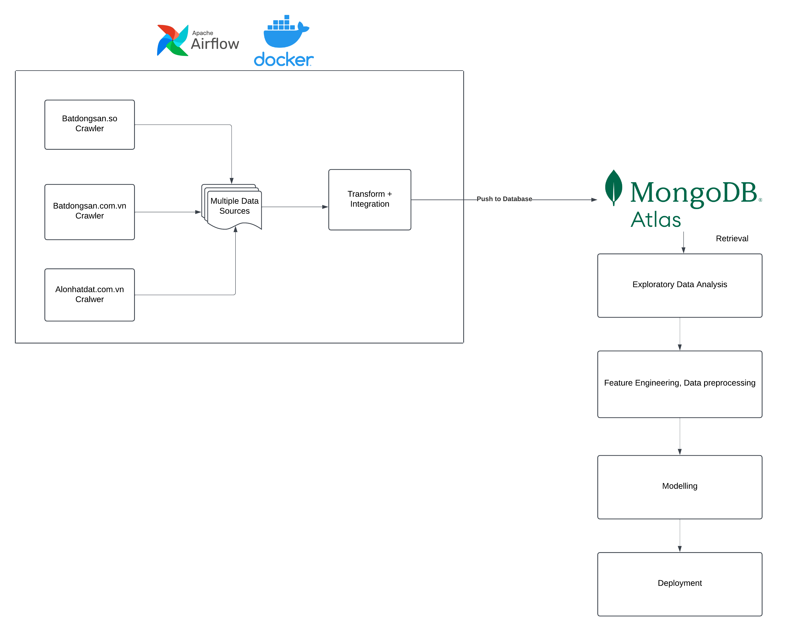

## Real-Estate-Analysis

A capstone project focusing on Vietnamese's real estate analysis and prediction 

## Features

This repo contains a full pipeline from data collection to transforming \& integrating data and pushing to the final database (located in pipeline.py)

<p align="center">
  
</p>

The real-estate data are crawled from three websites: "Alonhadat.com.vn", "Batdongsan.so", and "Batdongsan.com.vn".

Notebooks for exploratory data analysis are located in the EDA folder (EDA/VietnamRealEstateEDA.ipynb)

Other notebooks for modeling (XGBoost, Ridge Regression, Random Forest) (Modeling/XGBoostModeling.ipynb, Modeling/RidgeRegressionModeling.ipynb, RandomForestModeling.ipynb)

## Requirement

To run the pipeline for the data collection, you must have installed Python version >= 3.9. It is also highly recommended that you disable the Path Length Limit when installing Python, which will avoid any issues when installing the necessary libraries to run the project.

## How to use: 
To use this project using git, please do the following.
* First, open the command prompt / or any related terminals in the directory of the project

* Secondly, install required libraries via requirement.txt

```pip install -q -r requirements.txt```
* Finally, run the pipeline of the project by

```python pipeline.py```

## Optional

* If you want to run the demo application, please run the demo via command
```streamlit run App.py```

* If you want to setup Apache Airflow for continuous run of data scraping, please follow the following steps:

1. Install [Docker](https://docs.docker.com/engine/install/) and [Docker compose](https://docs.docker.com/compose/install/)
2. Run  ` docker compose up -d `
3. Access to the Apache Airflow UI via `http://localhost:8080/`
4. Login to the UI with the default username is `airflow` and default password is `airflow`
